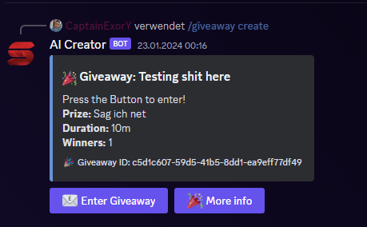

# Leveling System

## Commands:

- **`/giveaway`**: Der Hauptkommand.
- **`/giveaway list`**: Zeigt eine Liste der Aktuellen Giveaways an.
- **`/giveaway create [Name] [Duration] [Winners] [Prize] [Prize_Role]`**: Hiermit kann schnell und effizient ein Gewinnspiel erstellt werden. Die Duration gibst du an in 10m oder 90d. Dies steht aber Command nochmal.
- **`/giveaway delete [Name]`**: Hiermit wird ein Giveaway gelöscht.
- **`/giveaway end [Name]`**: Hiermit wird ein Giveaway vorzeitig ohne Gewinner beendet.

## Funktionialität:

**Jeder Benutzer kann einmal Teilnehmen.**
**Es werden die angegebene Anzahl von [Winners] genommen als Gewinneranzahl.**
**DAS GIVEAWAYSYSTEM WIRD AKTUELL AUSGEBAUT!!!!! NICHT NUTZEN!.**

## System Details:

