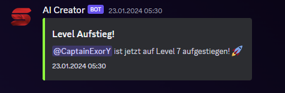

# Leveling System

## Commands:

- **`/leveling`**: Der hauptkommand.
- **`/leveling enable [Channel]`**: Wenn du beim aktivieren einen Channel mit angibst, kommen die Benachrichtigungen in den ausgewählten Channel statt in den wo der Nutzer das neue Level erreicht hat.
- **`/leveling achievement [Level] [Role]`**: Setzte pro Level eine Rolle.
- **`/leveling multiplier [User] [Multiplier]`**: Hiermit wird der Multiplizierungsfaktor eines Benutzers angepasst.

## Funktionialität:

**Jedes Wort ist 1 Punkt wert, sofern der Benutzer einen Mulitilikator von 1 hat.**
**Benutzer sollen engagiert werden mehr zu schreiben.**

## System Details:

- **Unbegrenzte Level**: Level gibt es unendlich, sie werden nur von mal zu mal schwerer.
- **Punktanforderungsformel**: Für jedes Level werden 180 Nachrichten benötigt, wobei sich die Anforderungen für jedes folgende Level um das 1,5-fache erhöhen.
- **Multiplikator**: Benutzer können ihre Punkte schneller ansammeln, indem sie ihren Multiplikator anpassen.

