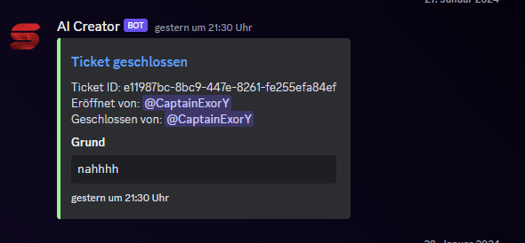
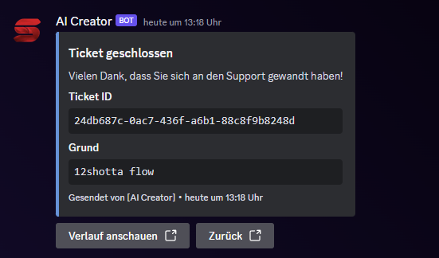

# Tickets & Templates

Um das Ticket Template zu verwenden, befolge diese Schritte:

1. Melde dich auf dem Dashboard unter [https://dashboard.smarterbot.de/](https://dashboard.smarterbot.de/) an.

2. Wähle unter **Manage Guilds** im linken Menü den Server aus, den du verwalten möchtest.

3. Auf der Guild-Seite gehe zu **Tickets** und füge alle benötigten Felder hinzu:

   - **Titel**: Der Titel der eingebetteten Nachricht, die gesendet wird.
   - **Beschreibung**: Die Beschreibung der eingebetteten Nachricht (der innere Teil).

   Richte dann die Ticket-Kategorien 1-5 ein mit:

   - **Button-Text**: Der Text auf dem Button zum Erstellen der Kategorie, im Grunde der Kategoriename.
   - **Kategorie**: Wähle die Server-Kategorie aus, unter der das Ticket erstellt werden soll, oder richte alle Tickets in einer Kategorie ein, wie gewünscht.
   - **Staff Roles**: Weise einer oder mehreren Rollen die Zuständigkeit für diese Tickets zu.

4. Klicke auf **Speichern**.

Sobald du diese Schritte abgeschlossen hast, gib `/tickets template` auf deinem Server ein, an der Stelle, an der du die Nachricht haben möchtest, und du hast dein benutzerdefiniertes Setup.

- **PS: Lässt sich ein Ticket mal doch nicht mehr per Knopf schließen, geb im Ticket einfach /tickets close [ID] [Reason]. Die ID steht in jeder Eröffnungsnachricht eines Tickets, worin auch der Command genutzt werden sollte.**

